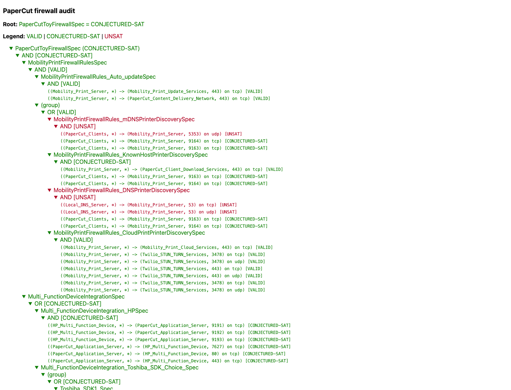

# PaperCut Auditor Tutorial

This tutorial audits a PaperCut deployment using a complete Cisco
configuration, a partial inventory, and an Elastispec specification. Run all
commands from the repository root.

Complete the
[README quick start](README.md#quick-start-simplified-papercut-example) first.
The full reusable specification and inventory template are in the
[PaperCut specification package](specifications/papercut/README.md).

## 1. Review The Inputs

| Input | File |
| --- | --- |
| Complete Cisco IOS configuration | [toy_firewall_config.txt](examples/papercut_toy/toy_firewall_config.txt) |
| Server inventory | [inventory.json](examples/papercut_toy/inventory.json) |
| Elastispec specification | [papercut_toy.fsl](examples/papercut_toy/papercut_toy.fsl) |

### Elastispec Specification

The toy specification covers Mobility Print, multifunction devices, external
databases, and optional card readers:

```text
def PaperCutToyFirewallSpec as
    MobilityPrintFirewallRulesSpec AND
    Multi_FunctionDeviceIntegrationSpec AND
    ExternalDatabaseSpec AND
    CardReadersSpec?
```

### Firewall Configuration

The scenario is a common enterprise posture: **allow-all outbound, protect the
server zones**.

| Subnet | Interface | Purpose |
| --- | --- | --- |
| `10.10.20.0/24` | `GigabitEthernet0/0` | ECE client network |
| `10.10.30.0/24` | `GigabitEthernet0/1` | CS client network |
| `172.16.10.0/24` | `GigabitEthernet0/2` | PaperCut application and Mobility Print servers |
| `172.16.20.0/24` | `GigabitEthernet0/3` | PostgreSQL database |

The server and database outbound ACLs contain `permit ip any any`. Traffic
toward those protected zones is restricted to the required application ports.
The configuration also quarantines client `10.10.20.66` from the server pool.

The included
[toy_firewall_config_asa.txt](examples/papercut_toy/toy_firewall_config_asa.txt)
expresses the same policy as a Cisco ASA 9.12(4) configuration.

### Inventory

The server inventory lists PaperCut Application Server and Mobility Print
Server separately even though the example maps both roles to the same two
hosts.

| Inventory value | Meaning | Example |
| --- | --- | --- |
| IP addresses or CIDRs | Known deployment | `PaperCut_Application_Server`, `PostgreSQL_Database` |
| `["N/A"]` | Role not deployed | `Oracle_Database`, `MySQL_Database` |
| `["web"]` | External server; the Auditor skips external server policies | `Mobility_Print_Cloud_Services` |
| `{}` or omitted | Role unresolved | `PaperCut_Clients`, device roles, `Local_DNS_Server` |

```json
{
  "PaperCut_Application_Server": {
    "host_ip": ["172.16.10.2", "172.16.10.3"]
  },
  "Mobility_Print_Server": {
    "host_ip": ["172.16.10.2", "172.16.10.3"]
  },
  "PostgreSQL_Database": {
    "host_ip": ["172.16.20.40"]
  },
  "Oracle_Database": {
    "host_ip": ["N/A"]
  }
}
```

## 2. Run The Auditor

```bash
./auditor/scripts/run_auditor_docker.sh \
  --config auditor/examples/papercut_toy/toy_firewall_config.txt \
  --inventory auditor/examples/papercut_toy/inventory.json \
  --spec auditor/examples/papercut_toy/papercut_toy.fsl \
  --output auditor/output/papercut_toy.html \
  --title "PaperCut firewall audit"
```

Open `auditor/output/papercut_toy.html`. Windows users can run the equivalent
PowerShell command in the
[README quick start](README.md#quick-start-simplified-papercut-example).

## 3. Read The Compliance Tree

The compliance tree indicates which policies in the document have been
implemented in the configuration (GREEN) and which ones have not (RED).



For example, the Mobility Print known-host and cloud-print discovery options
have been configured, while mDNS and DNS discovery have not been configured.
Since at least one of these four options has been configured and the auto-update
has also been configured, the `MobilityPrintFirewallRulesSpec` is met.
Specifically, mDNS is red because UDP `5353` is not permitted toward the server,
and DNS is red because TCP/UDP `53` is not permitted.

Notice that the green lines can be labeled either `VALID` or
`CONJECTURED-SAT`:

- `VALID` means the related entities have explicit server inventory mappings
  and the configuration satisfies the requirement. For example,
  `ExternalDatabaseSpec` is `VALID` because the application server and
  PostgreSQL database have explicit mappings and TCP `5432` is permitted.
- `CONJECTURED-SAT` means an entity is unresolved, but the Auditor found
  candidate address ranges that would satisfy the requirement. For example,
  the known-host discovery branch is `CONJECTURED-SAT` because
  `PaperCut_Clients` is not mapped.

The root is `CONJECTURED-SAT`: every required branch is either valid or
satisfiable under the displayed candidate mappings.

The compliance tree uses `?` to mark an optional branch:

- `?` (optional): the branch keeps its own verdict for display but does not
  make its parent fail. For example, the optional card-reader branch does not
  block the root.

### Interpreting Conjectures

The `Conjectures` table in the compliance report shows the candidate ingress
interfaces and source prefixes without enumerating every candidate address.
Even though the ACLs only say "campus" (`10.0.0.0/8`), the conjecture is
narrowed to `10.10.20.0/24` (ECE) and `10.10.30.0/24` (CS), the only modeled
ingress interfaces whose connected sources are permitted through. The CIDR
cover is exact: on the ECE interface it jumps from `10.10.20.64/31`
(`.64-.65`) to `10.10.20.67/32`, skipping `10.10.20.66`, which the deny rule
quarantines. Network, gateway, and broadcast addresses are also excluded, so
the result is a list of prefixes rather than one `/24`.

An unexpected IP present in the conjecture (e.g., a non-campus IP or an overly
broad range) warrants review.

## 4. Run The ASA Variant

```bash
./auditor/scripts/run_auditor_docker.sh \
  --config auditor/examples/papercut_toy/toy_firewall_config_asa.txt \
  --inventory auditor/examples/papercut_toy/inventory.json \
  --spec auditor/examples/papercut_toy/papercut_toy.fsl \
  --output auditor/output/papercut_toy_asa.html \
  --title "PaperCut ASA firewall audit"
```

The IOS and ASA reports should have the same high-level verdicts.

## 5. Hands-on Experiments

### Experiment 1: Find A Mandatory Failure

The provided
[toy_firewall_config_missing_postgresql.txt](examples/papercut_toy/toy_firewall_config_missing_postgresql.txt)
omits the rule allowing the application-server subnet to reach PostgreSQL on
TCP `5432`.

```bash
./auditor/scripts/run_auditor_docker.sh \
  --config auditor/examples/papercut_toy/toy_firewall_config_missing_postgresql.txt \
  --inventory auditor/examples/papercut_toy/inventory.json \
  --spec auditor/examples/papercut_toy/papercut_toy.fsl \
  --output auditor/output/papercut_toy_missing_postgresql.html \
  --title "PaperCut audit: missing PostgreSQL rule"
```

The PostgreSQL leaf, `ExternalDatabaseSpec`, and root should become `UNSAT`.
Compare this report with the baseline before reviewing a real configuration.

### Experiment 2: Review A Conjecture

In the baseline report, inspect the `PaperCut_Clients` rows in the
`Conjectures` table. Confirm that the candidate interfaces and prefixes match
the expected campus client networks and that `10.10.20.66` is excluded. This
shows how an unresolved inventory role can be evaluated without treating a
candidate range as a confirmed inventory mapping.

## 6. External Servers

Campuses may adopt a variety of methods for dealing with external servers
(e.g., a proxy, NAT, etc.), so the Auditor currently skips policies related to
reachability of external servers.
